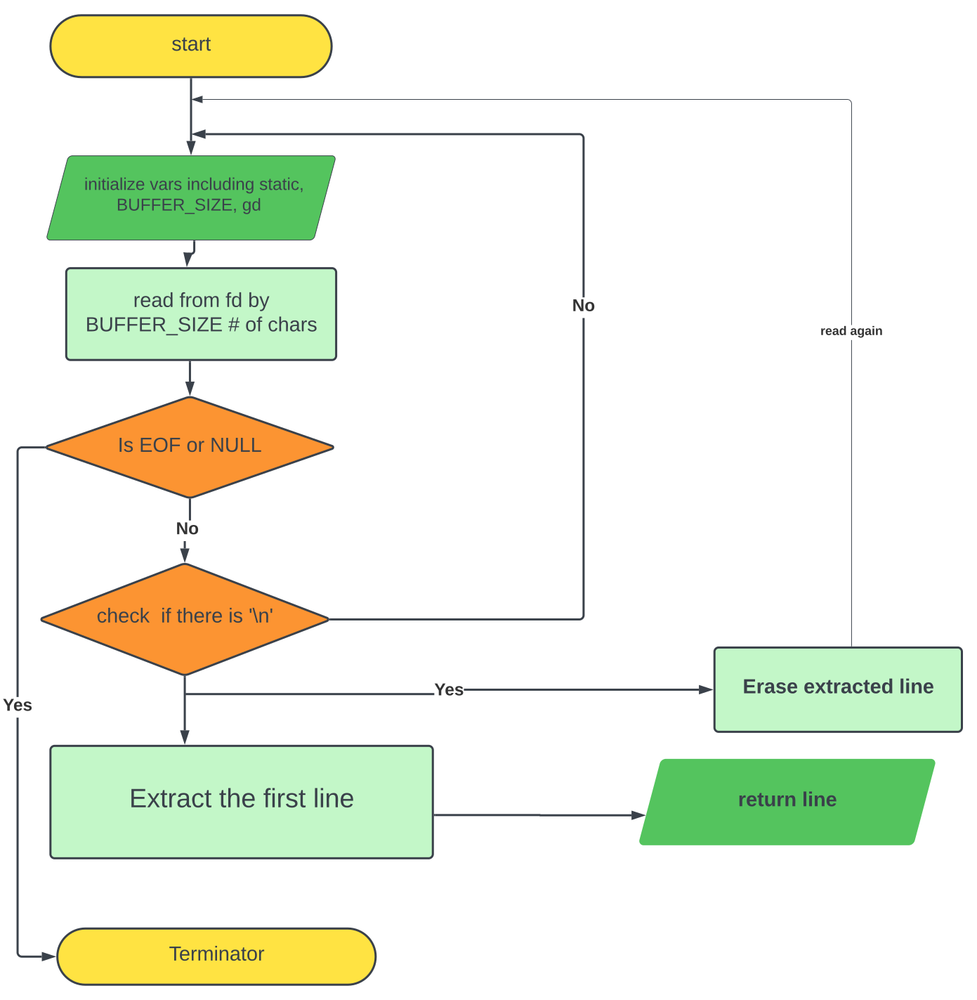

# 42_get_next_line
get_next_line is a function that reads and returns one line at a time from a file or input stream. It maintains a saved buffer between calls, allowing you to read lines sequentially.

## A. Mandatory Part

  ### Algorithm

  
  
  # USAGE
  1. To clone
     
    ` git clone https://github.com/MerKifle/42_get_next_line.git `
  
  2. To compile the program
  
     ``` cc -Wall -Werror -Wextra get_next_line.c get_next_line_utils.c -D BUFFER_SIZE=<size> ```

## B. Bonus Part
The fundamental concept of the bonus part remains identical to the mandatory part, with the added capability to read from multiple files. Consequently, the opened file descriptors are stored in the saved[] array, serving as indexes where the read characters are stored.
